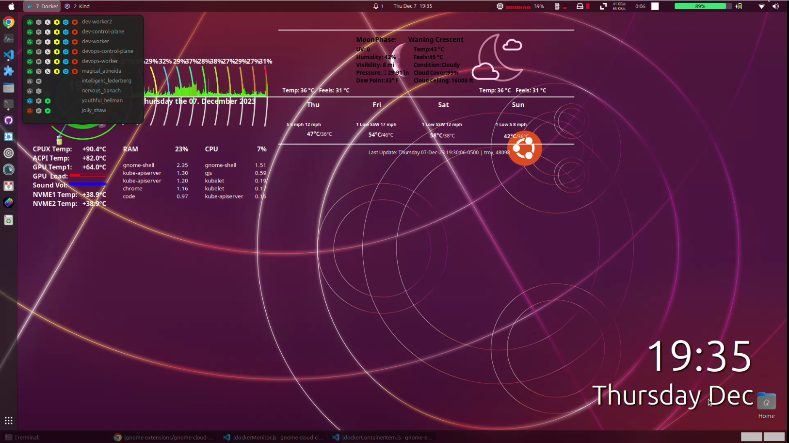
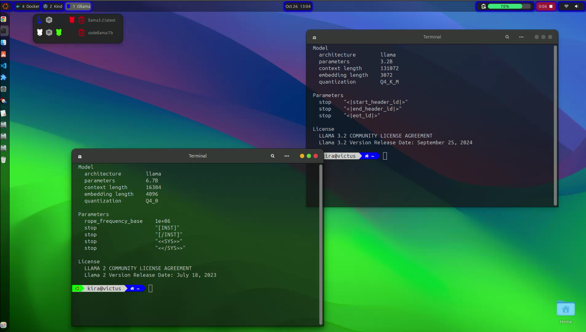

# gnome-extensions
Developing different gnome-extensions

### Copy `gnome-debug.desktop` file to enable debug of the gnome extension
- Change the path in `gnome-debug.desktop` for `Exec` and `Icon` as per your `{user}` home directory path
```
cp gnome-debug ~/bin
cp gnome-debug.svg ~/bin
cp gnome-debug.desktop ~/.local/share/applications
```

### dev-container-manager extension

- [dev-container-manager](https://github.com/devopsnextgenx/gnome-extensions/tree/main/dev-container-manager%40devopsnextgenx)

[](https://youtu.be/Ah-LQxtOHak)

[](https://youtu.be/mMjJ08jSmGo)

- To run Ollama and chat with it, install ollama on machine.
- Run docker container with below command
    ```
        docker run -d --name gui-react-ollama -p 4000:80 amitkshirsagar13/gui-react-ollama
    ```

## Like this Extension?

You can support my work on [ko-fi](https://ko-fi.com/devopsnextgenx).

Also consider donating to [GNOME](https://www.gnome.org/support-gnome/donate/)