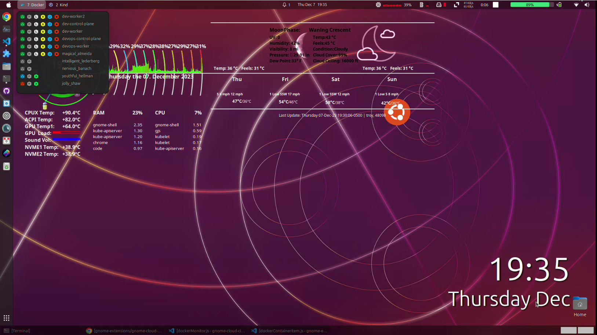

### dev-container-manager extension

## Like this Extension?

You can support my work on [ko-fi](https://ko-fi.com/devopsnextgenx).

Also consider donating to [GNOME](https://www.gnome.org/support-gnome/donate/)

<!-- https://github.com/Tudmotu/gnome-shell-extension-clipboard-indicator
https://extensions.gnome.org/review/45679
https://github.com/bajcmartinez/nordvpn-status -->
